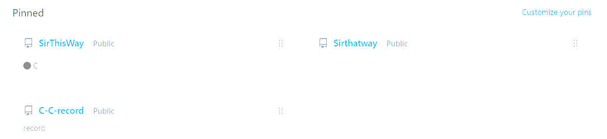
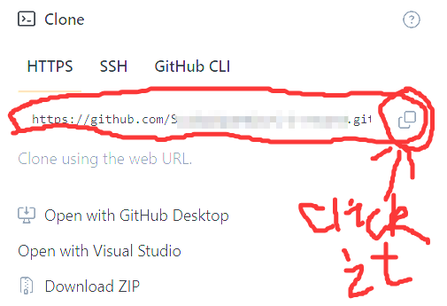
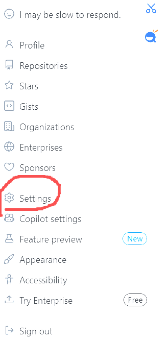
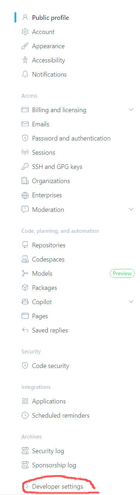
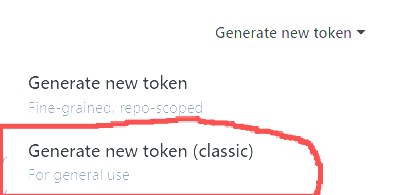
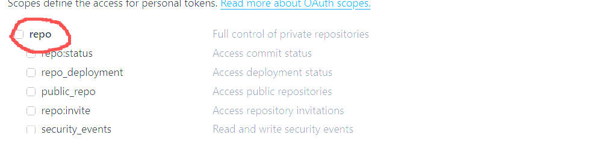

# 
github提交文件流程（命令行版）

## 可能的报错:Something went really wrong, and we can’t process that file.
> 
我们在使用加速器或代理登录GitHub页面后,可能会遇到可以下载或查阅文件,但是无法在库中上传自己的本地文件这种情况,基于此,我尝试了一些解决办法,例如:
 
>> + 更换代理
>> - 更换加速器
>> + 更换浏览器
>>> ------------------------对我而言,都没有有效解决文件无法上传的问题
>>>如果你也遇到了和我一样的麻烦,那么我推荐你使用**命令行**提交,以下是全部流程
 <right>本文中,括号内均为占位符,按你的实际情况输入,比如**(UserName)**,你就应该在括号位置输入你的github用户名,或者直接粘贴你复制的整段,而不是直接复制粘贴我的</right>
>>>>首先,你需要知道自己的**Git远程仓库地址**,那么如何获取呢?
>>1.在Github上,打开你想添加文件的Pinned

>>2.点击你期望的Pinned,然后找到code并点击

>>3.找到你的Git远程仓库地址,并复制它

>>>>接下来,win+r,输入cmd,打开命令行(这里就不给图片了).在这之后,输入

    git clone https://github.com/(UserName)/(your repository name).git

>>>>这会克隆你的仓库到本地（会创建一个 `(your repository name)` 文件夹

    cd (your repository name)

>>>>这会打开你的本地文件夹,你需要把你需要上传的文件放进这个文件夹,或者使用git add 命令添加文件

    git add (file name1.(后缀)) (file name2.(后缀))...

>>>>推荐你检查一下当前状态

    git status

>>>>如果出现

    On branch main
    Your branch is up to date with 'origin/main'.
    Changes to be committed:
    (use "git restore --staged <file>..." to unstage)
            new file:   (file name1.(后缀))
            new file:   (file name2.(后缀))
            new file:   (file name3.(后缀))

>>>>则代表成功

>>>>之后,在-m 后面的内容是提交说明，你可以根据需要修改(也可以不进行这一步操作)

    git commit -m "提交说明"

>>>>最后一步,完成提交,你需要输入

    git push origin main

>>>>稍等片刻,浏览器会弹出,让你登录你Github账号,输入你的用户名和密钥
>>>>在Username for 'https://github.com':输入你的用户名,这里我推荐你直接复制粘贴,不要自己输
    
    Username for 'https://github.com':(UserName)

>>>>在Password for https://(Username)@github.com'输入你的密钥
<right>注意,这里的密钥password不是你的登陆密码,不要着急把你的密码填上去.并且,在这行你不会看到任何你输入的内容,这是正常的</right>

>>>>接下来,跟着我的步骤获取你的密钥
1.打开你的Github账户的settings

2.点击左侧底部的Developer settings

3.点击Personal access tokens(classic)

4.点击Generate new token(classic)

5.按如下配置填写：
Note：填写一个描述，例如 My PC Push Token。
Expiration：选择一个有效期，例如 90 days。
Select scopes：务必勾选 repo（它包含了所有仓库的读写权限）。这是推送代码所必需的。

6.滚动到页面底部，点击 “Generate token”。
7.新页面会显示一串以 ghp_ 开头的长字符串。立即复制它（离开页面后就无法再查看）。

>>>>上一步完成之后,回到你的命令行,然后直接将你复制的那一串ghp_开头的字符串粘贴到命令行中,**不要怀疑你的眼睛**,如果你确保你的键盘正常,那么就**直接回车**,不要多次ctrl+v!**直接回车**

>>>>如果操作正确,你会看到类似:

    Enumerating objects:6.done.ounting objects:100%(6/6),done.Delta compression using upto32 threadsompressing objects:100%(5/5)，done.Nriting objects:10%(5/5)，277.85 KiB30.87 MiB/s, done.Total 5(delta 0),reused 0(delta 0),pack-reused 0(from 0)To https://github.com/SuiSuiSparkle/C-C-record.gitb472621..f1b4f7b main>main

>>>>此时,你就已经提交成功了,你可以在你的Pinned看到你提交的新文件,否则,你会在命令行看到

    remote: invalid credentialsfatal: Authentication failed for https://github.com/(UserName)/(your repository name).git/'  

>>>>这说明你认证失败了,仔细再试一下git push origin main步骤吧

<right>我也是初学者,这次就分享到这了</right>
